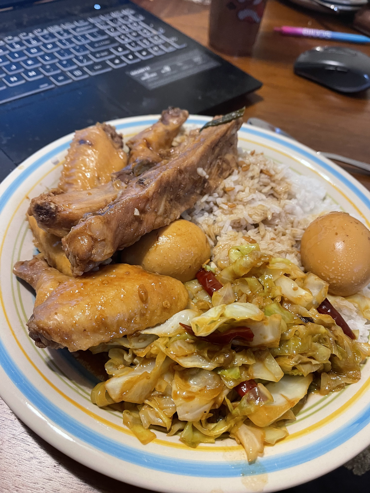

Pan-fry cabbage recipe

Half a cabbage for 2 people. Soy sauce, oyster sauce, chicken bouillon, sugar, 2-3 tbsp minced garlic, and 4-7 dried chili peper.

1. Remove the stem of the cabbage and chop it to slices. Then chop the slices in half.

2. Prepare in a small bowl 3 tbsp of soy sauce, 1 tbsp oyster sauce, 0.5 tbsp of chicken bouillon, and 1/3 tbsp of sugar. Mix well.

3. Heat up a frying pan with oil. Put in 2-3 tbsp of minced garlic to taste. Manually break 4-7 dried chili peppers(depends on your spice tolerance. I'm not that good, but I usually do 6-7 pieces, or it probably won't be a significant taste in the end results) into half/thirds and throw them into the pan with the garlic. Fry till fragrant.

4. Throw in the cabbage (carefully). Mix, stir, and pan-fry for 5 minutes.

5. Pour in the sauce mix and mix well with the cabbage slices. Put the lid on and cook until the cabbage soft and turn to a somewhat yellow color (check and stir the cabbage periodically). You can also have it a bit fresh and green, but it's more marinated and spicy if it turns somehow yellow if you prefer it that way.

6. Eat it with other dishes.

