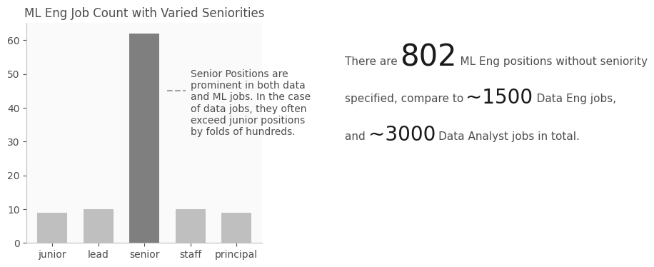
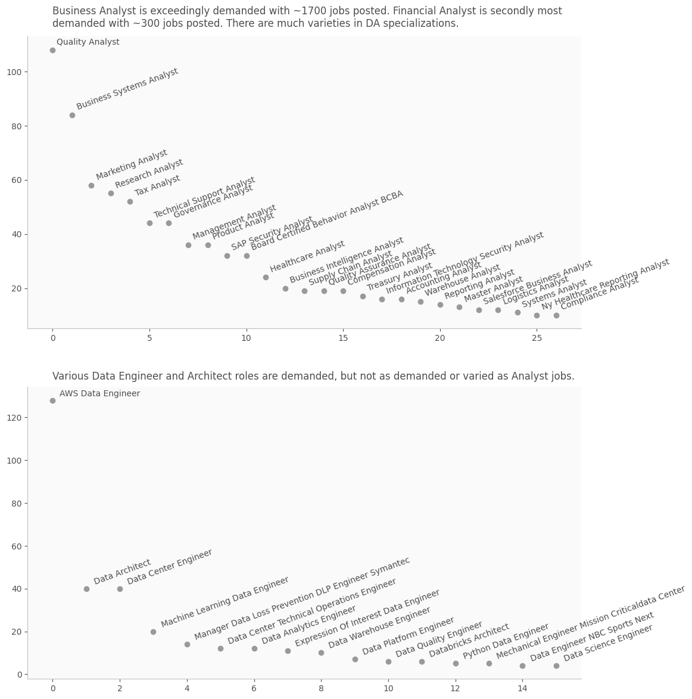

This post follows our first post analyzing LinkedIn data job market by first cleaning and process the job postings. Before any analysis on the postings are conducted, it's helpful to analyze the trends in job titles first. In this blog, we try to analyze major demanded job titles and create some visualizations to tell stories about what we've found.

We follow the follow steps:

1. Get and clean Data and ML jobs.

2. Get most popular job titles for Data and ML jobs, and visualize number of jobs with different seniorities.

3. Get specialized Analyst and Data Engineer jobs and visualize.

[The google colab for this is here](https://colab.research.google.com/drive/1GlTFGd0Wik-d3SK7GYYXgiK0hEtFO5r8?usp=sharing). Feel free to make a copy, download the data, and play around with the code.

The method we uses to get those job titles will follow a simple pattern: define key words and match titles. It's straightforward, so we'll only give an example here, and move on to the visualizations.

Here is one function that matches titles:

```python
def get_tuple(title, title_words, ranked_list):
    matched = ranked_list
    for word in title_words:
        match_word = [t for t in matched if word in t[0].lower()]
        matched = match_word
    if len(matched) >= 1:

        # this lines adds up title counts if there are more than one
        # matched titles, like "data analyst" and "Data Analyst"
        return (title, sum([t[1] for t in matched]))
    else:
        return None
```

We filter `ranked_list` iteratively by matching words in `title_words` one by one. And then we adds up all matching title counts and use `title` as an umbrella title for all matching titles.

Another version of this later is much longer than this one but not much more complicated. The alteration is to add a `negatives` argument, and delete those "negative words" from the title to see if the title only consists of negative words. Here, negative words could be "data", and "junior". So if we want specialized analyst titles, then we want to filter for titles with the word "analyst", but also words other than just "data" or "junior" in the title. So we would add "data" and "junior" as "negative words".

With the data we have, I created the following visualizations. The first one paint the picture of trends in major data job titles, like the number of seniority positions, and comparisons between different titles. Here are the graphs:


## Design Choices Explained

I made several choices here to make the graph as clear as possible and easy to read.

1. Used big markers to mark each data point.

2. Used clearly distinguished color for each line, that are also accessible to people who're color blind.

3. Added labels for each job title instead of using legends so that it's crystal clear which line represents which job category without the user having to go back and forth to read the legends.

4. Used grey as backgrounds and for other elements like axis, ticks and numeric labels that are only references and not as important.

5. Added reference lines for y = 0, 75 so that the reader is able to roughly estimate the values of the lower clustered points. And added only necessary numerical labels for higher points so that the y-values are clear to the readers.

6. Added direct explanation of graphs to avoid misintepretations.

7. Seperated the above to 2 graphs and hided the y-axis of the right graphs so that the viz is clean.

The code seems long but it's just a lot of commands to set cosmetics.

In the end, I added a simple horizontal bar graph for comparing titles without the seniority specified. Because some of these jobs can be senior level jobs, we have it in a separate graph to report accurately. I also added another one for job title counts in total, because it tells a slightly different story than the first one - the difference in number of DS and DA jobs are more significant.

## Visualization Proceeds

I made two more visualizations, one about ML engineer positions with varied seniorities, and another one about specialized data analysts positions.





I used primarily grey color scales here because it's cleaner for representations. For the first graph, I greyed out the other 4 seniority levels to show how much Senior level positions are more prominent than any other higher level positions. Then I make the total counts bigger so that the reader will be draw to that specific piece of information.

In the last graph, I used a uniformly grey color scale so that each specialized job title could be given attention, since we want to show a diverse set of titles. Meanwhile, the title helps explain a bit more information, and the position of the point indicates the popularity of that specialized job title.

The charting codes are all in the notebook and are omitted here because they are long and you can achieve what you want by simple googling. Thanks for reading.
