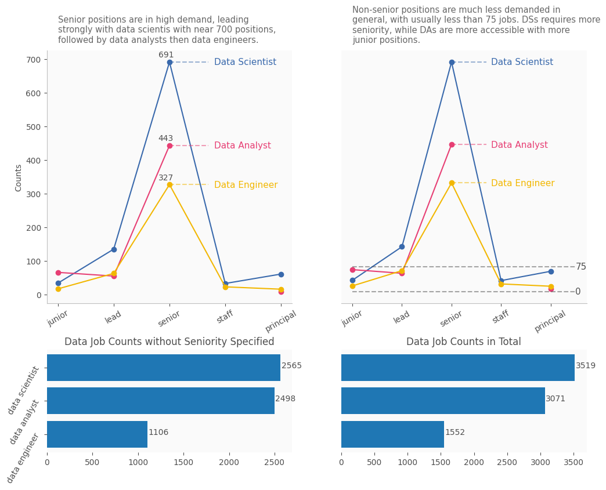
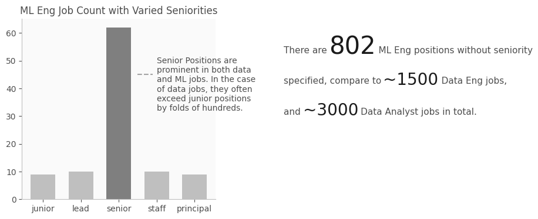

This post is a report of the LinkedIn data job market after first creating a dataset for LinkedIn job positings from 2023. Before any analysis on the job postings are conducted, it's helpful to analyze the trends in job titles first. My findings analyzing job titles are reported here.

First, I looked at the three main data job titles, and their varied seniority levels.

From this graph, we can see several points. First, Data Scientists have more jobs than the other two titles across all seniority levels except on junior levels, which is expected since they are expected to conduct complex AI applied research projects that requires more experience. Secondly, there are much more Senior-level jobs than junior, lead, staff or principal. This reflects what I see in the market at 2023.

From the top right graph, we can see that: any other seniority level with all jobs have less than 75 postions listed except lead Data Scientists where there are more than 100 listed. Data Scientists are even more demanded in the principal level, while Data Anlayst is much more accessible and demanded in the junior level.

If we only plot numbers of job titles without specified seniority level, we can see that DSs and DAs are relatively similarly demanded, while Data Enigneers are half as demanded compare to the previous two. If we include job titles with seniority level, and compare number of job titles listed in general, then DSs are more significantly demanded than DAs with ~500 more jobs listed, and Data Engineers are again around half as demanded as DAs.

I also visualized similar information for ML engineers.

It's clear from the graph that Senior-level jobs are prominent across all categories. From the total counts of jobs, ML Engineers are a bit more than half as demanded as Data Engineer jobs.

Finally, I plotted a diverse set of various specialized analyst and data engineering jobs, with their popularity associated.

It shows a bunch of interesting different specializations within analysts and data engineering jobs. I hope this will provide people who're looking to specialize some options and ideas.

In conclusion, this report tries to picture the data and ML job market through visualizations of job titles, their seniorities, and specialized job titles. Hope this report provided some new insights.
