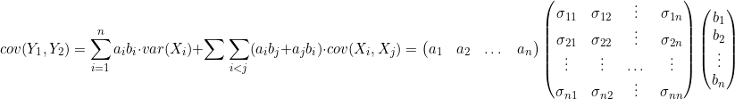

Note: (*) means that bullet point is not mentioned in class but in handout.

# Expected Values

- The **expected value, E(X)** of X, a **discrete** random variable with probability function f(x), is: $E(X) = \sum_{x}x \cdot f(x).$.

- The **expected value, E(X)** of X, a **continuous** random variable with probability function f(x), is: $E(X) = \int_{-\infty}^{\infty}x \cdot f(x)dx$.

- The **expected value, $E[g(X)]$** of g(X), X a **discrete** random variable with probability function f(x), is: $E[g(X)] = \sum_{x}g(x) \cdot f(x).$.

- The **expected value, $E[g(X)]$** of g(X), X a **continuous** random variable with probability function f(x), is: $E[g(X)] = \int_{-\infty}^{\infty}g(x) \cdot f(x)dx$.

- **Operation properties**:
    1. $E(aX + b) = a \cdot E(X) + b$
    2. $E(aX) = a \cdot E(X)$
    3. $E(b) = b$

- **Theorem 4.3**: If $c_1, c_2, ..., c_n$ are constants, then $E[\sum_{i=1}^{n}c_i \cdot g_i(X)] = \sum_{i=1}^{n}ci \cdot E[g_i(X)]$.

- The **expected value, $E[g(X, Y)]$** of g(X, Y), X, Y **discrete** random variables with probability function f(x, y), is: $E[g(X, Y)] = \sum_{x}g(x, y) \cdot f(x, y).$.

- The **expected value, $E[g(X, Y)]$** of g(X, Y), X, Y **continuous** random variables with probability function f(x, y), is: $E[g(X, Y)] = \int_{-\infty}^{\infty}\int_{-\infty}^{\infty}g(x, y) \cdot f(x, y)dxdy$.

- **Theorem 4.5**: If $c_1, c_2, ..., c_n$ are constants, then $E[\sum_{i=1}^{n}c_i \cdot g_i(X_1, X_2, ..., X_n)] = \sum_{i=1}^{n}ci \cdot E[g_i(X_1, X_2, ..., X_n)]$.

# Moments

- Similarly to "momentum" in physics, describes shape of and changes in probability distributions in different degrees. 

- I like to think of it as calculus for probability distributions. 

- Ex. the second degree describes the variance, or degree of variety in the distribution, like degree of changes of a functionn in calculus;

- The third degree describes the skewness, and the fourth describes kurtosis, which is flatness/peakedness of the probability distribution like the max/min point of a function in calculus.

- The **r-th moment** about the **origin** of a random variable X, $\mu_r'$, is the expected value of $X^r$
    - X is **discrete**: $\mu_r' = E(X^r) = \sum_{x}x^r \cdot f(x)$ for $r = 0, 1, 2, ...$.
    - X is **continuous**: $\mu_r' = E(X^r) = \int_{-\infty}^{\infty}x^r \cdot f(x)dx$.

- When **r = 0**, $\mu_0' = E[X^0] = E(1) = 1$ which makes sense becuase we are basically just summing/integrating the probability distribution function, which gives us the cumulative function for $X \leq 1$ which is always 1.

- When **r = 1**, $\mu_1' = E(X^1) = E(X) = \mu$.

- The **r-th moment** about the **mean** of a random variable X, $\mu_r$, is the expected value of $(X - \mu)^r$
    - X is **discrete**: $\mu_r' = E((X - \mu)^r) = \sum_{x}(x - \mu)^r \cdot f(x)$ for $r = 0, 1, 2, ...$.
    - X is **continuous**: $\mu_r' = E((X - \mu)^r) = \int_{-\infty}^{\infty}(x - \mu)^r \cdot f(x)dx$.

- When **r = 0**, $\mu_0 = E[X^0] = E(1) = 1$.

- When **r = 1**, $\mu_1 = E((X - \mu)^1) = E(X) - E(\mu) = \mu - \mu = 0$.

- The **variance** of X, $\mu_2$ is denoted by $\sigma^2$ or $\sigma_x^2$, $Var(X)$, or $V(X)$.
    - The **standard deviation** of X, $\sigma$, is the positive root of the variance.

- The **spread** of the distribution is measured by $\mu_2 = \sigma^2$.

- The **skewness/symmetry** of the distribution is measured by $\frac{\mu_3}{\sigma^3}$.

- The **kurtosis(flatness/peakedness)** of the distribution is measured by $\frac{\mu_4}{\sigma^4}$.

- **Theorem 4.6**: $\sigma^2 = \mu_2' - \mu^2$.

- **Theorem 4.7**: $Var(aX + b) = a^2 \cdot \sigma^2$.

# Chebyshev's Theorem

Given $\mu$ and $\sigma$ the mean and standard deviation of X, for any positive k, the probability is at least $1 - \frac{1}{k^2}$ that X will be within k standard deviations of the mean. Mathematically, $P(\mid x - \mu \mid \leq k \cdot \sigma) \geq 1 - \frac{1}{k^2}$.

# Moment-Generating Functions(MGFs)

- MGFs are useful because they allow you to calculate moments easily with an explicitly defined function, which is easier than calculating the expected value directly. 

- The n-th moment about 0 is the n-th derivative of the MGF, evaluated at 0. For example, the expected value of X is the first derivative of the MGF evaluated at t equal to zero, and X squared is the second derivative.

- Also, MGFs are unique, so if the MGF exists for a random variable, then there is one and only one distribution associated with that MGF.

- The **moment generating function** of  X, where it exists, is given by 
    - $M_X(t) = E(e^tX) = \sum_x e^tX \cdot f(x)$, when X is **discrete**, and 
    - $M_X(t) = E(e^tX) = \int_{-\infty}^{\infty} e^tX \cdot f(x)dx$, when X is **continuous**.

- **Theorem 4.9**: $\frac{d^rM_x(t)}{dt^r}\mid_{t = 0} = \mu_r'$.

- **Theorem 4.10**: If a and b are constants, then
    1. $M_{X+a}(t) = E(e^{(X+a)t}) = e^{at}M_X(t)$,
    2. $M_{bX}(t) = E(e^{bXt}) = M_X(bt)$
    3. $M_{\frac{X+a}{b}}(t) = E(e^{\frac{X + a}{b}t})=e^{\frac{a}{b}t}M_X(\frac{t}{b})$
    - Particularly, $M_{\frac{X-\mu}{\sigma}}(t) = E(e^{\frac{X-\mu}{\sigma}t}) = e^{\frac{\mu}{\sigma}t}M_X(\frac{t}{\sigma})$

# Product Moments

- The **r-th and s-th moment** about the **origin** of a random variable X, Y, $\mu_{r, s}'$, is the **expected value** of $X^rY^s$
    - X, Y is **discrete**: $\mu_{r, s}' = E(X^rY^s) = \sum_{x}\sum_{y}x^ry^s \cdot f(x, y)$ for $r, s = 0, 1, 2, ...$.
    - X, Y is **continuous**: $\mu_{r, s}' = E(X^rY^s) = \int_{-\infty}^{\infty}\int_{-\infty}^{\infty}x^ry^s \cdot f(x, y)dxdy$.

- $\mu_{1, 0}' = E(X) = \mu_x$, $\mu_{0, 1}' = E(Y) = \mu_y$.

- The **r-th and s-th moment** about the **mean** of a random variable X, Y, $\mu_{r, s}'$, is the **expected value** of $X^rY^s$
    - X, Y is **discrete**: $\mu_{r, s} = E((X - \mu_X)^r(Y - \mu_Y)^s) = \sum_{x}\sum_{y}(X - \mu_X)^r(Y - \mu_Y)^s \cdot f(x, y)$ for $r, s = 0, 1, 2, ...$.
    - X, Y is **continuous**: $\mu_{r, s} = E((X - \mu_X)^r(Y - \mu_Y)^s) = \int_{-\infty}^{\infty}\int_{-\infty}^{\infty}(X - \mu_X)^r(Y - \mu_Y)^s \cdot f(x, y)dxdy$.

- The **covariance** of X and Y is: $\mu_{1, 1}$, denoted by $\sigma_{XY}$, $cov(X, Y)$, or $C(X, Y)$.

- $\sigma_{XY} = cov(X, Y) = C(X,  Y) = \mu_{1, 1} = E[(X - \mu_X)(Y - \mu_Y)]$.

- $\sigma_{XY} = \mu_{1, 1}' - \mu_X\mu_Y$.

- **Theorem 4.12**: If X and Y **independent**, then $E(XY) = E(X) \cdot E(Y)$ and $\sigma_{XY} = 0$.

- Independence implies zero covariance but not the other way around.

- **Theorem 4.13**: If $X_1, X_2, ..., X_n$ are independent, then $E(X_1, X_2, ..., X_n) = E(X_1) \cdot E(X_2) \cdot ... \cdot E(X_n)$.

# Moments of Linear Combination of Random Variables

- If Y is **a linear combination of** $X_1, X_2, ..., X_n$ are random variables and $Y = \sum_{i = n}^{n}a_iX_i$, where $a_1, a_2, ..., a_n$ are constants, then \[E(Y) = \sum_{i=1}^{n}a_iE(X_i) \text{, } var(Y) = \sum_{i=1}^{n}a_i^2var(X_i) + 2\sum\sum_{i<j} a_ia_j \cdot cov(X_i, X_j)\] where $1 < i, j < 1$.

- If $X_1, X_2, ..., X_n$ are **independent** and $Y = \sum_{i = n}^{n}a_iX_i$, where $a_1, a_2, ..., a_n$ are constants, then $var(Y) = \sum_{i=1}^{n}a_i^2var(X_i)$
    - **Reason**: $X_1, X_2, ..., X_n$ independent $\Leftrightarrow$ $cov(X_i, X_j) = 0$.

- The **covariance of $Y_1$, $Y_2$**, if $X_1, X_2, ..., X_n$ are random variables and $Y_1 = \sum_{i = n}^{n}a_iX_i$, $Y_2 = \sum_{i = n}^{n}b_iX_i$ where $a_1, a_2, ..., a_n$, $b_1, b_2, ..., b_n$ are constants, then: 

- The **covariance of $Y_1$, $Y_2$**, if $X_1, X_2, ..., X_n$ are **independent** random variables and $Y_1 = \sum_{i = n}^{n}a_iX_i$, $Y_2 = \sum_{i = n}^{n}b_iX_i$ where $a_1, a_2, ..., a_n$, $b_1, b_2, ..., b_n$ are constants, then \[cov(Y_1, Y_2) = \sum_{i=1}^{n}a_ib_i\cdot var(X_i)\]

# Conditional Expectations

- The **conditional expectation** of $\mu(X)$ given $Y = y$, $f(x \mid y)$ is the value of the conditional probability distirbution of X given $Y = y$ at x, is:
    - $E[\mu(X) \mid X = y] = \sum_x \mu(X) \cdot f(x \mid y)$ for **discrete** random variable X,
    - $E[\mu(X) \mid X = y] = \int_{-\infty}^{\infty} \mu(X) \cdot f(x \mid y)dx$ for **continuous** random variable X.

- The **conditional mean** of $\mu(X)$ given $Y = y$ is $E[\mu(X) \mid X = y]$ if we let $\mu(X) = X$, denoted by $\mu_{X \mid Y} = E(X \mid Y)$.

- The **conditional variance** of $\mu(X)$ given $Y = y$ is: \[Var(X \mid Y = y) = E((X - E(X \mid Y = y))^2 \mid Y = y) = E(X^2 \mid Y = y) - E(X \mid X = x)^2\]